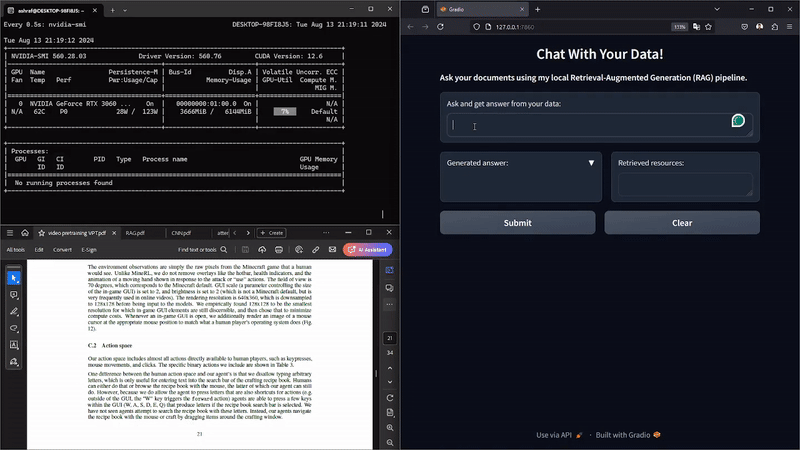
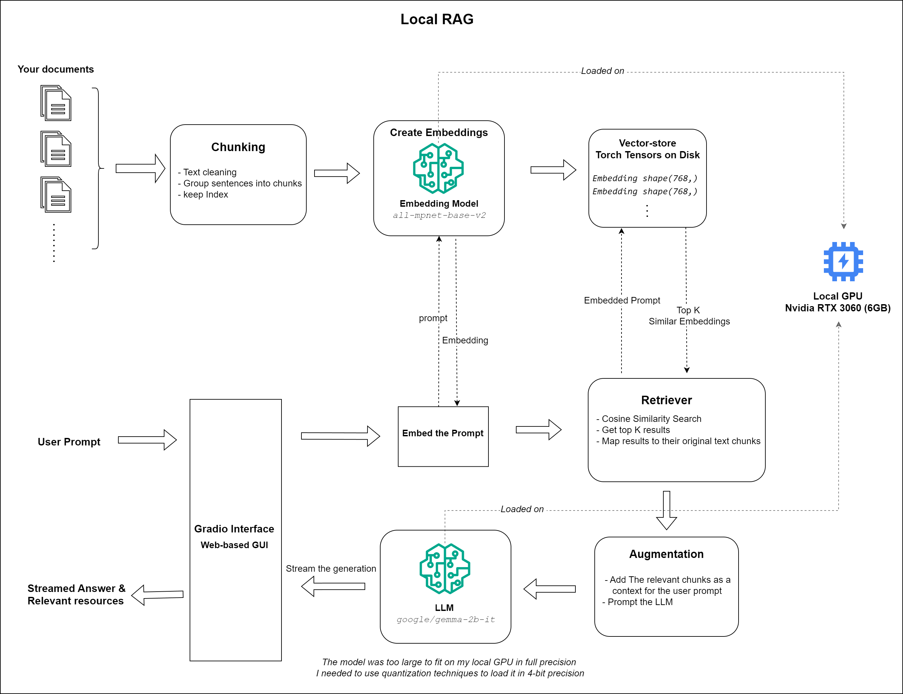
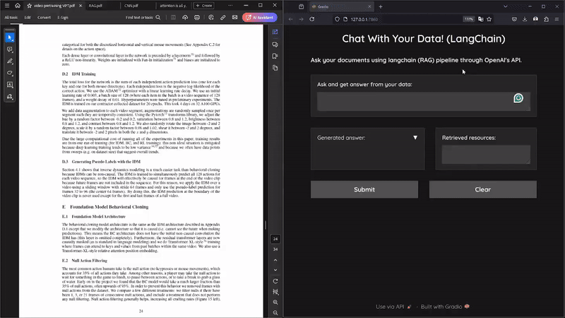
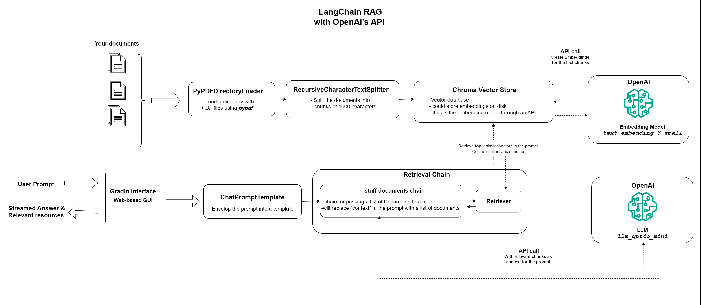

# Chat with My Data
This project aims to build a RAG pipeline for answering questions from a punch of documents. I have built two solutions: 

1. Local RAG pipeline running completely on my GPU (Nvidia RTX 3060 6GB)
2. LangChain RAG pipeline using OpenAI's API

### 1) Local RAG:
<center> 

</center>
<br/>
<br/>


#### Setup
You need first to make sure that you have installed cuda drivers correctly, after that you install the requirements:
```bash
pip install -r requirements.txt
```
Then you need to create a directory named **data/** under the root dir of the repository
and put your PDF files there. Now you need to embedd these files and store them in a local vector store:
```bash
python create_embedding.py
```
The embeddings will be saved under dir **vector_store**. Then to launch your RAG pipeline you need to run:
```bash
python local_rag_app.py
```
You should get a localhost link in the terminal, click on it then a web interface will appear asking you to write your query!

<br/>

#### Architecture
The following is a chart of the local RAG and all its components. You can notice that I've built the RAG from scratch using only pytorch and open-source models.
The models are hosted on my Nvidia GPU RTX 3060 6GB. The models that I have hosted:
1. Embedding model: **[all-mpnet-base-v2](https://huggingface.co/sentence-transformers/all-mpnet-base-v2)**
2. LLM:[ **google/gemma-2b-it**](https://huggingface.co/google/gemma-2b-it)
<center> 

</center>
<br/>
<br/>
<br/>


### 2) LangChain RAG:
<center> 

</center>
<br/>
<br/>
<br/>

#### Setup
If you have installed the requirements, then you only need to export you OpenAI key as an environment variable:
```bash
export OPENAI_API_KEY=<yourkey>
```
Then you only have to run this script:
```bash
python langchain_rag_app.py
```
You should get a localhost link in the terminal, click on it then a web interface will appear asking you to write your query!


#### Architecture
The following is a chart of the langchain RAG and all its components. The pipeline uses OpenAI API to access 2 models:
1. **text-embedding-3-small**: An Embedding model to create embeddings for the documents 
2. **gpt-4o-mini**: An LLM to get the answer with the relevant text chunks as a context  

<center> 

</center>
<br/>
<br/>
